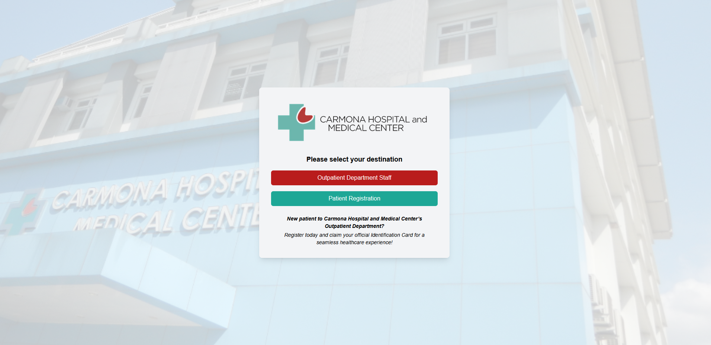

<p align="center">
  
</p>


**PrintMed: Patient Records Management System** is a full-stack web application built using Laravel and React, designed to streamline outpatient healthcare workflows.

## Key Features
- **Patient Online Registration.** Allows patients to register online before hospital visits, to reduce queue congestion.
- **QR Code-Based Identification.** Enables fast patient record access via QR code scanning.
- **Facial Verification.** Integrates facial recognition for verifying patient identity.
- **Prevention of Duplicate Patient.** Notifies for matching records based on first name, last name, birthdate, and sex; as well as facial recognition.
- **Security & Access Control.** Implements role-based access control (RBAC), two-factor authentication (2FA), and encryption of sensitive patient data at rest.
- **Audit System.** Tracks and logs user actions to ensure transparency and accountability.


## Prerequisites

- PHP ≥ 8.1
- Composer
- Node.js
- MySQL, MySQL Workbench


## Backend Setup (*printmed-api*)

1. **Open terminal and go to `printmed-api` directory**
2. **Install dependencies**
   ```bash
   composer install
   ```
3. **Configure environment**
   ```bash
   cp .env.example .env
   ```
   Edit `.env` for your database configuration:
   ```bash
   DB_DATABASE=printmed
   DB_USERNAME=your_username
   DB_PASSWORD=your_password
   ```
   Create a variable in `.env` for CipherSweet
   ```bash
   CIPHERSWEET_KEY=
   ```
   Generate a CipherSweet key
   ```bash
   php artisan ciphersweet:generate-key
   ```
4. **Enable `gd` PHP Extension**

   Locate `php.ini` in File Explorer and enable `extension=gd`
   ```bash
   extension=gd
   ```
5. **Run migrations and seed database**

   The *users* table in database is pre-populated, particularly of an admin account. Open `database\seeders\UserSeeder.php` to view or edit initial login credentials.
   ```bash
   php artisan migrate
   php artisan db:seed
   ```

6. **Run the server**
   ```bash
   php artisan serve
   ```
## Frontend Setup (*printmed-frontend*)
1. **Open terminal and go to `printmed-frontend/printmed` directory**
2. **Install dependencies**

   ```bash
   npm install
   ```
3. **Run the frontend**

   ```bash
   npm run dev
   ```
   Visit http://localhost:5173 to use the app.


## Email Functionalities
This project includes features that require email service (e.g., OTP verification, account notifications, emailing files).

For development and testing, **`Mailtrap`** is used, which captures outgoing emails that can be viewed and debugged without sending real emails.

To configure:

1. **Create a Mailtrap account and get SMTP credentials.**

2. **Update your `.env` with the Mailtrap credentials:**
   ```bash
   MAIL_MAILER=smtp
   MAIL_HOST=sandbox.smtp.mailtrap.io
   MAIL_PORT=2525
   MAIL_USERNAME=your_mailtrap_username
   MAIL_PASSWORD=your_mailtrap_password
   ```
   Laravel’s built-in Mailables and Notifications system will use this configuration automatically for sending emails.

To integrate production-ready email APIs, you can use providers like SendGrid and Mailgun.


## Facial Recognition
Amazon Rekognition was utilized to integrate facial recognition, in features like verifying identity and preventing duplicate patient record.

For basic implementation:
1. **Sign up for an AWS Account [here](https://signin.aws.amazon.com/signup?request_type=register)**
2. **Open the [IAM Console](https://console.aws.amazon.com/iam/). In the navigation pane, *choose Users*.**
3. **Create a user with Amazon Rekognition administrative access**
4. **Under its security credentials tab, choose Create Access Key**
5. **Configure `.env` (Laravel)**
   
   ```bash
   AWS_ACCESS_KEY_ID=your_access_key_id
   AWS_SECRET_ACCESS_KEY=you_secret_access_key
   AWS_DEFAULT_REGION=your_aws_region
   ```
7. **Create the Collection**
   - Open Postman (install if you don't have)
   - Send a POST request to http://127.0.0.1:8000/api/create-collection

For additional information, visit the Amazon Rekognition [official documentation](https://docs.aws.amazon.com/rekognition/latest/dg/getting-started.html).


## QR Code Generation
This project uses the package `simplesoftwareio/simple-qrcode` for QR Code generation. On top of it, `imagick` PHP extension needs to be enabled.

Instruction:
1. **Check your PHP setup thru terminal**
   
   ```bash
   php -v
   ```
   Take note of PHP version, Thread Safety, and Architecture.
3. **Download [imagick](https://pecl.php.net/package/imagick) that matches your PHP setup**
4. **Extract the ZIP**
5. **Copy `php_imagick.dll` to `\php\ext\` folder**
6. **Copy the other `.dll` files to `\php\` folder**
7. **Enable the extension in php.ini**
   - Open `php.ini`.
   - Add or ensure this line exists:
     
     ```bash
     extension=imagick
     ```


## PDF Generation
This project uses the **Snappy PDF** package in Laravel for features requiring PDF generation (e.g., downloading audits). Snappy is a wrapper around `wkhtmltopdf`, which converts HTML to PDF.

Download [wkhtmltopdf](https://wkhtmltopdf.org/downloads.html) and install. Ensure that it is located in `C:\Program Files`.

For additional details, visit the [official documentation](https://github.com/barryvdh/laravel-snappy) of Snappy PDF.

<!--## Real-time Functionality

This project utilizes Pusher to enable real-time updates (e.g., patient registration and vital signs).

1. **Create Pusher App**
   - Sign up to [Pusher](https://pusher.com/).
   - Create a new Channels app, named `printmed`.
   - Copy your credentials: ID, Key, Secret, and Cluster.

2. **Configure `.env` (Laravel)**
   ```bash
   BROADCAST_DRIVER=pusher

   PUSHER_APP_ID=your_app_id
   PUSHER_APP_KEY=your_app_key
   PUSHER_APP_SECRET=your_app_secret
   PUSHER_APP_CLUSTER=your_cluster
   ```
3. **Configure Echo (React)**
   - Go to `printmed\src\utils\pusher\echo.js`.
   - Change the value of `key` to your Pusher App Key.-->


## Troubleshooting
### I.  MySQL Connection Refused ###
```
SQLSTATE[HY000] [2002] No connection could be made because the target machine actively refused it
```
This is likely because the MySQL Server is not running. 

**Solution:**
1. **Open Windows Run (`Win + R`)**
2. **Type:**

   ```
   services.msc
   ```
4. **Find `MySQL80` (or similar, e.g. `MySQL`)**
5. **Right-click → *Start***
6. **Right-click → *Properties***
7. **Set *Startup type* to ` Automatic `**
4. **Click *Apply***

### II.  Missing Script "dev"
```
npm error Missing script: "dev"
```
This is likely because of wrong directory in running the frontend server. Unintentionally, the default directory is `\printmed-frontend`. To solve this error, you must simply change directory to `\printmed-frontend\printmed`. 

In your React terminal, execute:

```bash
cd printmed
```

